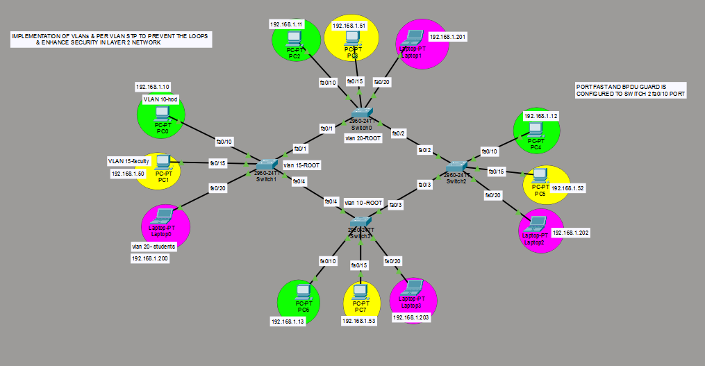

# VLAN, PVSTP & Layer 2 Loop Prevention

A Cisco Packet Tracer networking project demonstrating VLAN segmentation, Per-VLAN Spanning Tree Protocol (PVSTP), Layer 2 loop prevention, PortFast, and BPDU Guard.

## 📌 Project Overview

This project demonstrates the design and implementation of a Layer 2 switched network using Cisco Packet Tracer.

The network uses multiple switches with redundant connections to demonstrate how Spanning Tree Protocol (STP) prevents Layer 2 switching loops. PVSTP is used to maintain a separate spanning-tree instance for each VLAN, allowing different switches to act as root bridges for different VLANs.

The project also demonstrates the use of PortFast and BPDU Guard on appropriate access ports to improve Layer 2 network stability and security.

## 🎯 Objectives

- Implement VLAN-based network segmentation.
- Configure multiple VLANs across Cisco switches.
- Implement PVSTP for Layer 2 loop prevention.
- Configure different root bridges for different VLANs.
- Understand redundant switch connectivity.
- Demonstrate STP-based loop prevention.
- Configure PortFast on appropriate end-device ports.
- Configure BPDU Guard to protect access ports from unexpected BPDU messages.
- Verify network connectivity and STP behavior using Cisco Packet Tracer.

## 🛠️ Technologies & Tools

- Cisco Packet Tracer
- Cisco IOS
- VLAN
- IEEE 802.1Q
- Spanning Tree Protocol (STP)
- Per-VLAN Spanning Tree Protocol (PVSTP)
- PortFast
- BPDU Guard
- Layer 2 Switching
- Ethernet

## 🌐 Network Topology

The topology consists of multiple Cisco switches connected through redundant Layer 2 links. End devices such as PCs and laptops are connected to the switches and assigned to different VLANs.



## 🧩 VLAN Configuration

The network contains multiple VLANs for logical segmentation.

| VLAN | Purpose |
|------|---------|
| VLAN 10 | Department / User Network |
| VLAN 15 | Faculty / Staff Network |
| VLAN 20 | Student Network |

VLANs provide logical separation between different groups of users while allowing the switching infrastructure to support multiple network segments.

## 🔄 PVSTP Implementation

Per-VLAN Spanning Tree Protocol (PVSTP) is used to prevent Layer 2 switching loops.

In this topology, different switches are configured as root bridges for different VLANs. This demonstrates how STP root placement can be distributed across the network.

Example:

- VLAN 10 → Root bridge configured on the appropriate switch
- VLAN 15 → Root bridge configured on the appropriate switch
- VLAN 20 → Root bridge configured on the appropriate switch

PVSTP allows each VLAN to have its own spanning-tree topology.

## 🔁 Layer 2 Loop Prevention

Redundant links between switches provide an alternate path in case of link failure. However, redundant Layer 2 paths can create switching loops.

STP identifies redundant paths and places selected ports into a blocking state when necessary. This creates a loop-free logical topology while maintaining redundancy.

When a forwarding path fails, STP can recalculate the topology and allow an alternate path to become active.

## 🔐 PortFast & BPDU Guard

### PortFast

PortFast is used on appropriate access ports connected to end devices.

It allows an access port to transition more quickly to the forwarding state instead of going through the normal STP transition process.

### BPDU Guard

BPDU Guard is configured on appropriate PortFast-enabled access ports.

It helps protect the network by shutting down an access port if unexpected BPDU messages are received.

This helps prevent an unauthorized switch from affecting the STP topology.

## 🖥️ End Devices

The topology contains PCs and laptops connected to different VLANs.

Example addressing used in the topology includes:

- 192.168.1.10
- 192.168.1.11
- 192.168.1.12
- 192.168.1.13
- 192.168.1.50
- 192.168.1.51
- 192.168.1.52
- 192.168.1.53
- 192.168.1.200
- 192.168.1.201
- 192.168.1.202
- 192.168.1.203

## 🧪 Verification

The network can be verified in Cisco Packet Tracer using commands such as:

```bash
show vlan brief
show spanning-tree
show spanning-tree vlan 10
show spanning-tree vlan 15
show spanning-tree vlan 20
show interfaces trunk
show running-config
